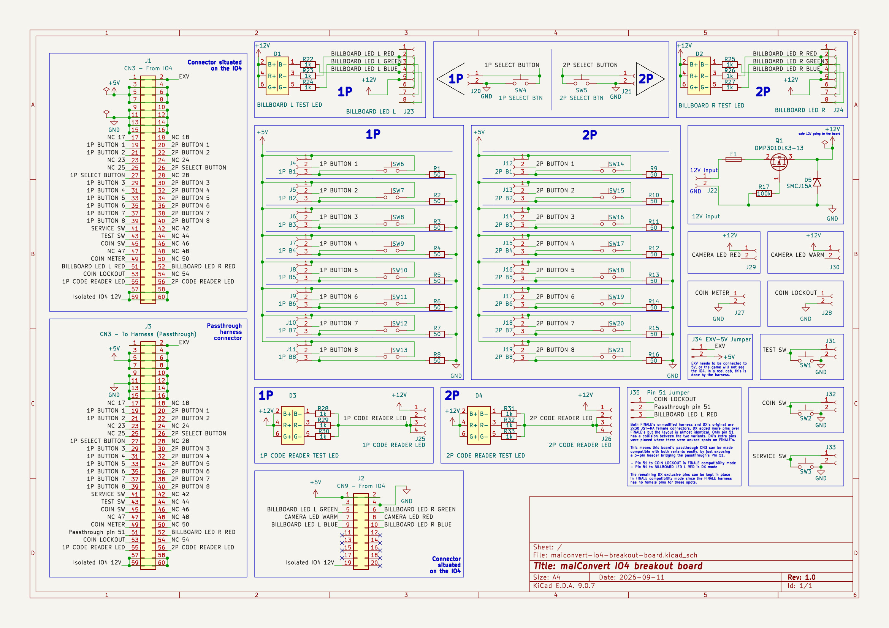
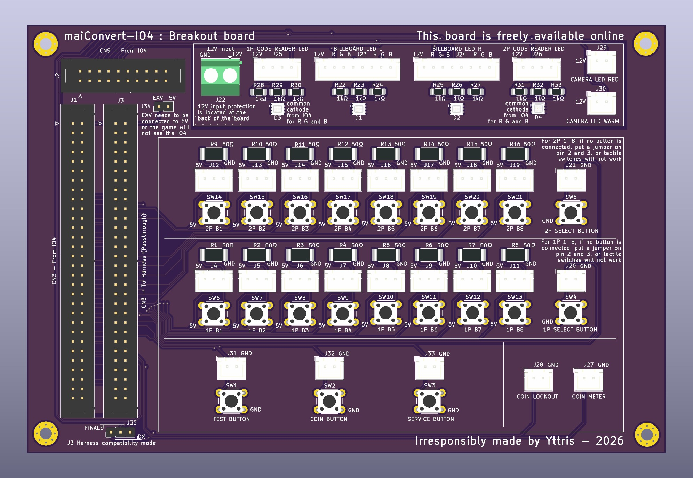
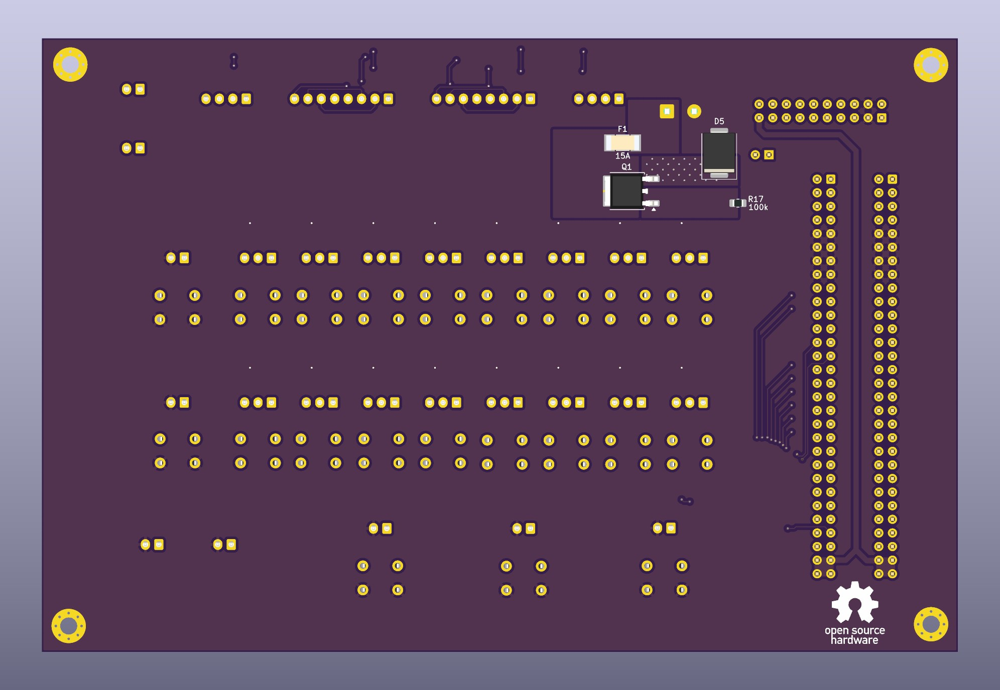

# maiconvert-io4-breakout-board

This breakout board is designed to be a helper for maimai FiNALE cabinet conversion to DX, to help people configure an IO4 home setup with a custom controller, or to serve as a testing setup for an IO4.

It can easily be installed between an IO4 and the cabinet harness thanks to its passthrough connector, supporting both FiNALE and genuine DX CN3 harnesses. If you do not have a harness to use, the board fans every I/O out to labeled JST-XH connectors and adds on-board test switches and RGB indicator LEDs.

  
  
  

Schematic - PCB 3D render (front) - PCB 3D render (back) - click any image for the full-size version

## Installation

The board requires 3 connections :

* You need to plug the CN3 and CN9 connectors from the IO4. The actual connector on IO4 is a JST-RA 2x30 pins, but you can use any connector with a pitch of 2.54mm. An IDC ribbon cable with two female connectors works great for that, you'll need a 2x30 and a 2x10.
* You also need to provide a clean 12V to the terminal block. If you're using the board in a cab, use the 12V PSU dedicated to LED lighting. Do not steal the 12V from the IO4.

There is basic protection at the entrance on the 12V rail on the board to prevent reverse polarity, but you are still responsible for providing clean current. The input is sized for 15A, though it should absolutely never reach that amount of current. There is a fuse right next to the connector. In case of issue, check that first.

## Use-cases

The board is intended for three parallel use-cases, designed with as little complexity and onboard logic as possible to ensure a minimal-to-null impact on gameplay. As such, you can use this board as a permanent addition to any cab without trade-off.

### Helper for maimai FiNALE cabinet conversion to DX

The main use-case. Install this board next to your IO4 in your FiNALE cab, connect CN3 and CN9 from the IO4, and plug in the cabinet's harness on the J3 connector.

There is a minor difference between the DX and FiNALE harness. On FiNALE's, the "Coin Locker" pin is at the position 51. On DX's, it is at the position 53, and 51 has been assigned to a billboard LED signal instead. To handle this difference, there are three pins right under the passthrough connector.

- **If your harness is a genuine DX (or an already modified FiNALE one)** :
  - Place a jumper over the two pins on the right
- **If your harness is an unmodified FiNALE** :
  - Place a jumper over the two pins on the left

The connection to the gameplay buttons is handled by the harness. However, since these do not exist on a FiNALE cab you will need to expose and connect the 1P and 2P SELECT BUTTONS to the appropriate JST-XH connectors.

The LED signals that DX now sends through the IO4 are exposed on the upper part of the board. You need to provide your own 12V power source for these to work. I advise using the cab's 12V LED PSU for this. Once properly powered, the test LEDs will light up with the signal sent by the game. You can now plug in your actual LEDs in the appropriate connectors. J23 and J24 for the billboard LED are designed to be compatible with the existing cables in a FiNALE cab covering the upper LEDs and the woofer LEDs. You will likely need a cable extension but you can plug those in directly on the board.

When the board has a CN3 harness plugged in on the passthrough J3 connector, only the `Test`, `Coin`, `Service`, and `1-2P Select` onboard tactile switches will work. The gameplay buttons' onboard tactile switches are disabled in this configuration.

Thanks to this, the board can be installed in the cab as a permanent addition with zero impact on performance.

### IO4 breakout board for home setup

If for your own reasons you want to run an actual IO4 in your home setup with your personal custom game controller, you can use this board to fan out the connectors from the IO4. Just connect the CN3 from the IO4 and plug in your buttons on the appropriate JST-XH connectors.

*Note :* the game expects buttons to be present. If you try running the board without plugging in the buttons, you will notice that the gameplay inputs are considered as continuously "pressed". See the "Test setup" case for ways to go around that, but it is not advised to use this board's tactile switches alone for actual gameplay.

If you want to install your own LEDs driven by the IO4, you can also do that. You need to plug in the CN9 connector with an IDC 2x10 female-female cable. You will also need to supply the 12V line with your own Mean Well PSU. Test LEDs should now light up as the game drives them and you can use the connectors to plug in your own LED strips. **Warning**: Do not put too much stress on the board, the copper is sized appropriately (excessively even) for the amount of current an actual cabinet's LED would draw, but if you put more load on the board then results may be unpredictable.

**Important note :** The game will not detect the IO4 if EXV is not bridged with 5V. In a normal cabinet, this is done by the harness. Here, **you need to install a jumper on the two dedicated floating pins situated next to the top right of the passthrough connector** normally dedicated to the harness.

In this configuration, both tactile buttons and gameplay buttons will work at the same time.

### A testing setup for an IO4

You may want to use the board to quickly test an IO4 you just received or you suspect faulty. Plug the CN3 and CN9 from the IO4, and plug your own 12V supply.

The LED section should light up as soon as the game starts driving them, you can use the onboard tactile switches to trigger the signals. Using it as-is though, you'll notice that the gameplay buttons' tactile switches do not actually work.

Because of the way the IO4 handles the gameplay buttons, it is normally not possible to test those signals if the actual button is not properly connected. This is because the IO4 natively puts that signal at HIGH, and the button assembly itself pulls it to LOW once it's connected. The IO considers that HIGH is "pressed", and LOW is "not pressed". Because of that behavior, unconnected buttons remain at HIGH and are always considered pressed.

To go around that, **for testing purposes you can put a jumper between pin 2 and 3 of the JST-XH connector**. That will bridge the signal in a forced LOW state that you can then activate using the onboard tactile button.

### Other uses

You might find other uses for this board that I hadn't thought about, though be aware that anything beyond the previous scope is not intended and the board behavior is not guaranteed.

## Fabrication

The PCB is designed to be fabricated bare at JLCPCB. See gerbers in `production/`.  
Components have to be hand-soldered. See the BOM in the `bom/` folder.

You can technically make JLCPCB assemble the board for you, but there are a lot of THT connectors on the board, and JLCPCB charges extra for each one of them. The extra price is most likely not worth the time, but you decide.

### To fab the PCB

On [jlcpcb.com](https://jlcpcb.com/) :

- Click "*Add gerber file*" and upload `production/maiconv-io4-breakout-board-gerbers.zip` as-is.
  - The auto-detected options already match this board (2 layers, 1.6 mm, 1 oz copper), just choose a solder mask color.
- Leave *PCB Assembly* off (all THT).
- Check the Gerber preview.
- Order.

### To order the parts

On [digikey.com](https://www.digikey.com/) :

- Go to *myLists* → *Create a New List* → *Upload a File* and upload `bom/digikey_upload.csv`.
- Map the columns to *Quantity* / *DigiKey Part Number* / *Customer Reference* (the header already uses those names).
- Review any out-of-stock lines, then add the list to your cart.
- Order.

## License

This board is distributed under the `CERN Open Hardware Licence Version 2 - Strongly Reciprocal` license. You are encouraged to share this page as much as you like and improve on the original design.

Please note that while the license doesn't strictly forbid it, I ask you to be a decent human being and to not make a business out of selling this board to anyone. This is free and should remain so. That being said, feel free to resell extra copies you may have gotten with your fabrication (they usually make them by stack of 5) to other people, as long as you do not charge an extortionate extra for them.

## Disclaimer

While I took great caution to make sure every component was properly sized, I am not a certified electronics engineer. This board is distributed freely without any guarantees, and you use it at your own risk. That being said, every component has been selected way above the actual minimal requirement of the circuit, so there shouldn't be any major issue.
